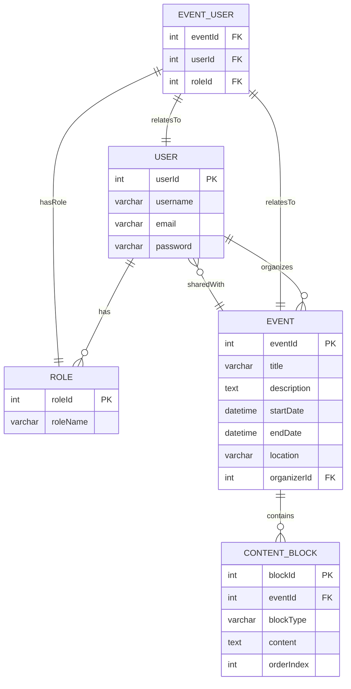

# eventmesh-pro Planning Document

## 1. User Personas

* **Event Organizer:**  Organizes events, requires intuitive interface for creating event structures, managing content, and collaborating with others. Needs real-time updates and seamless sharing capabilities.  Focuses on the visual aspects and the user experience of the event.
* **Content Creator:** Creates and manages event content, collaborates with organizers and other creators. Needs a powerful and flexible editor with versioning, AI assistance, and easy access to event details. Focused on rich content and efficient workflows.
* **Attendee:** Accesses and interacts with published events. Needs a clean, performant interface to browse events, view details, and potentially interact with event-specific features (e.g., Q&A, polls).


## 2. Functional Requirements

* **Event Creation:** Users (Organizers) can create new events with details like title, description, date/time, location, and agenda.
* **AI-Powered Content Generation:**  Users can leverage AI tools to automatically generate content for event descriptions, agendas, promotional materials, etc., based on prompts and templates.
* **Real-time Collaborative Editing:** Multiple users (Organizers & Content Creators) can edit event content simultaneously with changes reflected instantly for all collaborators.
* **Version Control:** The system should track changes to event content and allow users to revert to previous versions if needed.
* **Content Blocks/Modules:**  Modular content creation allowing users to add various content types (text, images, videos, polls, Q&A, etc.) to their events.
* **Sharing and Permissions:** Organizers can share events with specific users or groups with granular permission levels (view, edit, comment).
* **Publishing and Unpublishing:**  Organizers can publish events to make them accessible to attendees and unpublish them to hide them.
* **Attendee View:**  Provides a dedicated view for attendees to browse and view published events.
* **User Authentication and Authorization:** Secure user accounts and access control based on roles and permissions.
* **Search and Filtering:**  Users can search and filter events based on criteria like keywords, date, location, etc.


## 3. Non-functional Requirements

* **Performance:**  The application should be responsive and provide a smooth user experience, even with multiple concurrent users and large events.
* **Scalability:**  The architecture should be scalable to handle increasing numbers of users and events.
* **Security:**  The application should protect user data and prevent unauthorized access.
* **Reliability:**  The application should be reliable and available with minimal downtime.
* **Usability:** The application should have a clean and intuitive user interface that is easy to navigate and use.
* **Maintainability:** The codebase should be well-structured and easy to maintain and update.


## 4. Entity-Relationship Diagram (ERD)




## 5. Suggested Tech Stack

* **Frontend:** Nuxt.js (SSR for SEO and performance, Vue.js ecosystem)
* **Backend:** Hapi.js (Robust Node.js framework, plugin architecture)
* **Database:** DynamoDB (NoSQL, scalable, serverless)
* **Hosting:** AWS (Serverless functions with Lambda, API Gateway, DynamoDB, S3 for static assets)
* **Real-time Communication:** WebSockets (for collaborative editing)
* **AI Integration:** OpenAI API, or similar services


## 6. File/Folder Architecture Plan (Monorepo)

```
eventmesh-pro/
├── packages/
│   ├── frontend/       // Nuxt.js application
│   │   ├── components/
│   │   ├── pages/
│   │   ├── plugins/
│   │   ├── store/
│   │   ├── nuxt.config.js
│   │   └── ...
│   ├── backend/        // Hapi.js server
│   │   ├── routes/
│   │   ├── models/
│   │   ├── services/
│   │   ├── plugins/
│   │   ├── server.js
│   │   └── ...
│   ├── shared/         // Shared code (e.g., data models, validation)
│   │   ├── models/
│   │   ├── utils/
│   │   └── ...
├── serverless/         // Serverless functions and configurations (if applicable)
│   ├── functions/
│   ├── config.yml
│   └── ...
├── package.json
└── ...
```


This planning document provides a solid foundation for developing the eventmesh-pro application.  Remember to adapt and refine these details as the project progresses and requirements evolve. This detailed breakdown ensures a clear understanding of user needs, technical specifications, and project structure, promoting efficient collaboration and successful project delivery. Remember that continuous evaluation and iteration are crucial throughout the development lifecycle.